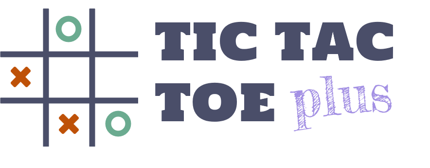

    

# Tic-Tac-Toe plus

A more complicated version of the classic game tic-tac-toe.

## Choose your language

- [English](./README.md)

## Installation

1. [Download](https://www.python.org/downloads/) and install python 3.11

2. Install pygame using the command: `pip3.11 install pygame`

3. Download game by clicking `Code -> Download ZIP` or using command: `git clone https://github.com/unichk/min-max_tic-tac-toe-plus.git`

4. Download game font from [google font](https://fonts.google.com/specimen/Tourney)

5. add `Tourney-ExtraBold.ttf` and `Tourney-SemiBold.ttf` to the game folder (min-max_tic-tac-toe-plus)

## Start the game

Open cmd in game folder and type in `py -3.11 tictactoe_plus.py`.

## Rules

Each player take turns putting marks, circle goes first and cross goes next until all 25 squares are full. The player who have marks in the following positions can get the corresponding scores. The player who has the highest score wins.

### 1. Diagonal-2: 2 points

Any two marks diagonal line with both end touches the border of the board.

    

### 2. Diagonal-3: 3 points

Any three marks diagonal line with both end touches the border of the board.

    

### 3. Diagonal-4: 4 points

Any four marks diagonal line with both end touches the border of the board.

    

### 4. Diagonal-5: 5 points

Any five marks diagonal line with both end touches the border of the board.

    

### 5. Straight: 5 points

Any row or column.

    

### 6. Square: 1 point

Any two by two square.

    

## License

This project is licensed under the BSD 3-Clause License - see the [LICENSE](LICENSE) file for details.
