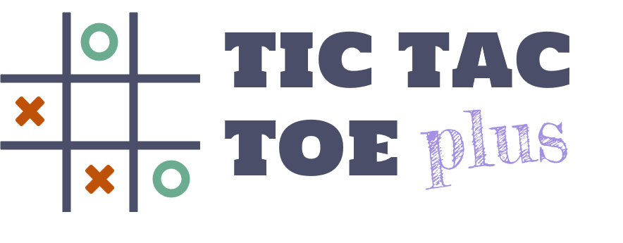

    

# Tic-Tac-Toe plus

一個更複雜版本的圈圈叉叉。

## 選擇語言

- [English](./README.md)
- [中文](./README_zh-tw.md)

## 安裝

1. [下載](https://www.python.org/downloads/) 並安裝 python 3.11

2. 使用指令安裝 pygame： `pip3.11 install pygame`

3. 從 `Code -> Download ZIP` 或使用指令：`git clone https://github.com/unichk/min-max_tic-tac-toe-plus.git` 下載遊戲

4. 從 [google font](https://fonts.google.com/specimen/Tourney) 下載遊戲字型

5. 將 `Tourney-ExtraBold.ttf` 和 `Tourney-SemiBold.ttf` 加入遊戲資料夾 (min-max_tic-tac-toe-plus)

## 開起遊戲

在遊戲資料夾中開啟 `cmd` 並輸入 `py -3.11 tictactoe_plus.py`.

## 規則

由圈先開始，接著兩位玩家輪流放置圈或叉直到25格全部被填滿。達成指定連線可以獲得對應分數，遊戲結束時總分較高的玩家獲勝。

### 1. 斜線-2：2分

任何長度為二且兩端皆碰到棋盤邊緣的對角線。

    

### 2. 斜線-3：3分

任何長度為三且兩端皆碰到棋盤邊緣的對角線。

    

### 3. 斜線-4：4分

任何長度為四且兩端皆碰到棋盤邊緣的對角線。

    

### 4. 斜線-5：5分

任何長度為五且兩端皆碰到棋盤邊緣的對角線。

    

### 5. 直線：5分

任何直行或橫列。

    

### 6. 方框：1分

任何2x2方格。

    

## 備註

- 玩家所操作的一方將以底線標示。
- AI最高可能花費15秒來思考下一步。

## 授權

本專案採用 BSD 3-Clause 授權 - 詳細內容請參閱 [LICENSE](LICENSE) 檔案。
